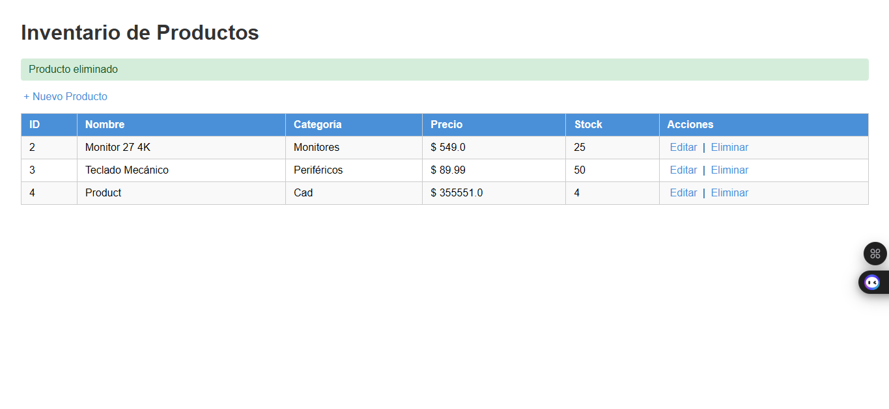
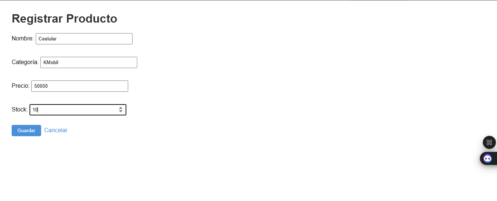
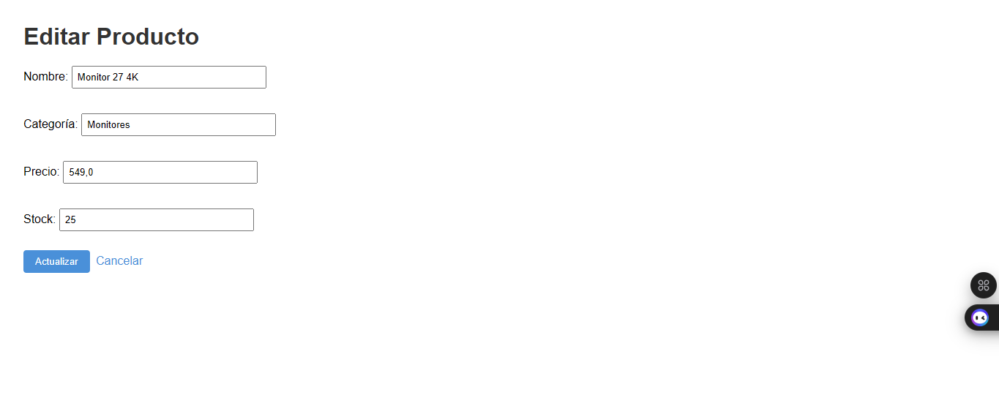
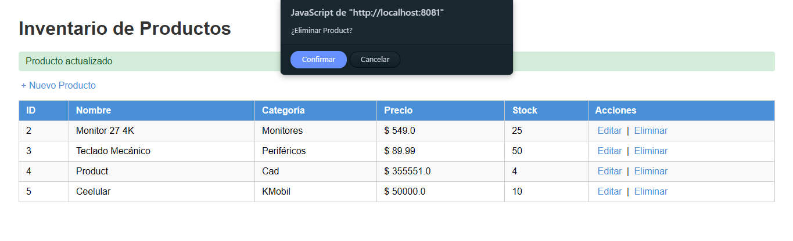
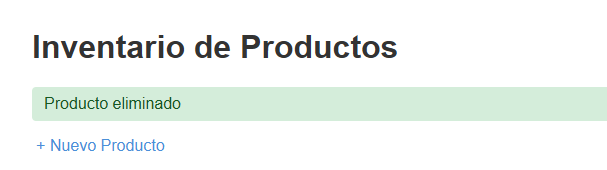

# mvc-productos — CRUD de Productos con MVC

**Autor:** Farid Lobo  
**Asignatura:** Programación Web  
**Universidad:** Universidad Francisco de Paula Santander  
**Unidad:** 6 — JSP con MVC
 
---

## Descripción

Aplicación web Java que implementa el patrón **MVC** para gestionar un inventario de productos. Utiliza **Servlets** como controlador, **JSP con EL y JSTL** como vista, y clases Java puras como modelo. Incluye un CRUD completo con redirección **Post/Redirect/Get**.
 
---

## Funcionalidades implementadas

- ✅ **Listar** productos con tabla estilizada
- 
- ✅ **Registrar** nuevo producto con formulario y validación
- 
- ✅ **Editar** producto existente con formulario precargado
- 
- ✅ **Eliminar** producto con diálogo de confirmación
- 
- ✅ Mensajes de éxito tras cada operación (POST/Redirect/GET)
- 
- ✅ Datos en memoria con DAO singleton (sin base de datos)
---

## Prerrequisitos

| Herramienta | Versión recomendada |
|---|---|
| JDK | 11 o superior |
| Apache Tomcat | 10.x |
| IDE | IntelliJ IDEA |
| Maven | 3.6 o superior |
| Git | Cualquier versión reciente |
 
---

## Estructura del proyecto

```
mvc-productos/
├── src/main/java/
│   └── com/universidad/mvc/
│       ├── model/
│       │   ├── Producto.java         ← Entidad del dominio
│       │   └── ProductoDAO.java      ← Acceso a datos (en memoria)
│       ├── service/
│       │   └── ProductoService.java  ← Lógica de negocio
│       └── controller/
│           └── ProductoServlet.java  ← Controlador MVC
├── src/main/webapp/
│   ├── WEB-INF/
│   │   ├── web.xml
│   │   └── views/
│   │       ├── lista.jsp             ← Vista: listado de productos
│   │       └── formulario.jsp        ← Vista: formulario crear/editar
│   └── css/
│       └── estilos.css
├── capturas/                         ← Capturas de pantalla
└── pom.xml
```
 
---

## Instrucciones de ejecución

### 1. Clonar el repositorio

```bash
git clone https://github.com/faridl28/tuapellido-post1-u6.git
cd tuapellido-post1-u6
```

### 2. Compilar con Maven

```bash
mvn clean package
```

### 3. Desplegar en Tomcat

**Opción A — IntelliJ IDEA:**
1. Ir a `Run → Edit Configurations`
2. Agregar `Tomcat Server → Local`
3. En **Deployment** seleccionar el artefacto `mvc-productos:war exploded`
4. Establecer **Application context** como `/mvc-productos`
5. Ejecutar con ▶️
   **Opción B — Manual:**
1. Copiar el `.war` generado en `target/` a la carpeta `webapps/` de Tomcat
2. Iniciar Tomcat con `bin/startup.sh` (Linux/Mac) o `bin/startup.bat` (Windows)
### 4. Acceder a la aplicación

```
http://localhost:8080/mvc-productos/productos
```

> Si el puerto 8080 está ocupado, usar el puerto configurado (ej. 8081).
 
---

## Capturas de pantalla

Las capturas se encuentran en la carpeta `/capturas/` del repositorio.

| Vista | Descripción |
|---|---|
| `lista.png` | Listado de productos con los 3 registros precargados |
| `nuevo.png` | Formulario de registro de nuevo producto |
| `editar.png` | Formulario de edición con datos precargados |
| `eliminar.png` | Diálogo de confirmación al eliminar |
| `mensaje.png` | Mensaje de éxito tras guardar/actualizar/eliminar |
 
---

## Tecnologías utilizadas

- Java 11
- Jakarta Servlet API 6.0
- JSTL 3.0 (Jakarta)
- JSP con Expression Language
- Apache Tomcat 10.x
- Maven 3.x
- HTML + CSS vanilla
---

## Patrón MVC aplicado

| Capa | Clase / Archivo | Responsabilidad |
|---|---|---|
| **Modelo** | `Producto.java` | Entidad del dominio |
| **Modelo** | `ProductoDAO.java` | Acceso a datos |
| **Modelo** | `ProductoService.java` | Lógica de negocio |
| **Controlador** | `ProductoServlet.java` | Recibe peticiones HTTP y delega |
| **Vista** | `lista.jsp` | Muestra el inventario |
| **Vista** | `formulario.jsp` | Formulario crear/editar |
 